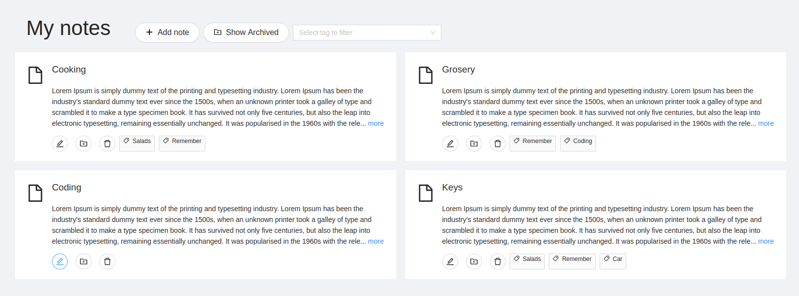

# Full Stack Notes App with Nest & React

Minimalist web notes app made with Nest as the main backend framework and React as the main frontend framework.

In order to correctly run the script that start the app the run machine must have __docker__, __docker-compose__ and __npm__.

Before running any script, be sure that the current login user can run docker without sudo privileges

Check that docker service is running before running the scrip, you can use `systemctl is-active docker` to check the status and try to start the service with `sudo systemctl start docker.service`.

The app was made with use __Postgres v13__, __NestJS v9.0__ and __React v18.2__

## Running the project

1. Before run, be sure that all the script have the right permission to run `chmod +x script-name.sh` can help

2. While being on the root folder use the following script to start the project `./prod-build.sh`, this will

    - Create and start the docker container for the database
    - Install dependencies and run server
    - Install dependencies and run client

### Pending

1. Login

    - Ideally made a entity user with a relationship oneToMany to notes, and build from there the logic including authentication

2. Live deployed version

    - The initial plan was made the app as easy as possible to run in a mac/linux machine, therefore docker was chosen to avoid any troubles with local configuring database on unknown environments

    - Heroku comes to mind to live deployment, but I believe the logic of the connection to the app could change a bit mainly adding .env variables and using them were is needed
